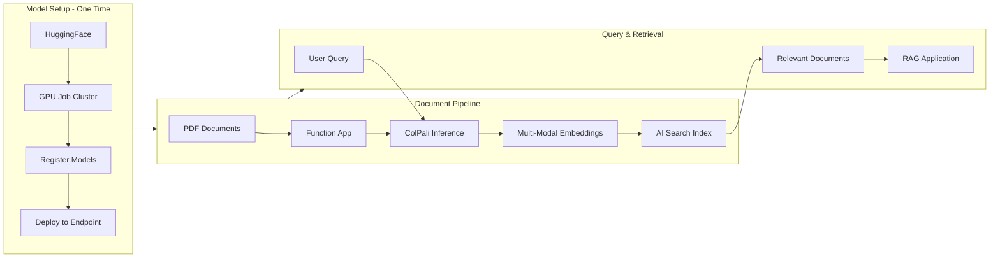

# ColPali on Azure

[](https://github.com/microsoft/dstoolkit-multi-modal-rag-with-colpali/actions/workflows/ci.yml)

Multi-modal RAG solution powered by ColPali for intelligent document understanding and retrieval. Deploy ColPali models on Azure with GPU-accelerated inference, serverless document processing, and vector search capabilities.



## What is ColPali?

ColPali combines visual and textual understanding to process documents as images, capturing layout, formatting, and visual elements that traditional text-only approaches miss. Perfect for complex documents like reports, forms, and technical papers.

## Key Features

- **Multi-Modal Intelligence**: Processes both text and visual document elements
- **GPU-Accelerated Inference**: Azure ML endpoints with A100/T4 GPUs
- **Serverless Processing**: Auto-scaling document pipeline with Azure Functions
- **Vector Search**: High-performance similarity search with AI Search
- **Production Ready**: Complete infrastructure with monitoring and security

## Quick Start

Ready to deploy? See the **[scripts/README.md](scripts/README.md)** for complete deployment instructions and automation scripts.

### Prerequisites
- Azure subscription
- Azure CLI
- Python 3.11+

Once deployed, upload PDFs to the storage container and watch them get processed automatically!

## Architecture

| Component | Purpose |
|-----------|---------|
| **Azure ML** | ColPali model hosting with GPU inference endpoints |
| **AI Foundry** | GPT-5 Chat model for intelligent document retrieval and RAG |
| **Storage** | PDF files and processed content |
| **Key Vault** | Secure credential management |

## Project Structure

```
├── infra/              # Bicep infrastructure templates
├── modules/
│   ├── colpali/        # ColPali model setup & deployment
│   ├── indexer/        # Function App (PDF processing)
│   └── index/          # AI Search index management
└── scripts/            # Deployment automation
```

## How It Works

1. **PDF Upload** → Triggers Function App processing
2. **Document Processing** → Extracts pages as high-resolution images
3. **ColPali Inference** → Generates multi-modal embeddings via Azure ML endpoint
4. **Vector Storage** → Stores embeddings in AI Search with metadata
5. **Query & Retrieve** → Semantic search returns relevant document sections
6. **Intelligent Retrieval** → AI Foundry's GPT-5 Chat model powers advanced RAG capabilities

## Documentation

- **[Infrastructure Guide](infra/README.md)** - Detailed architecture and deployment
- **[Deployment Guide](scripts/README.md.md)** - Step-by-step setup instructions

## Contributing

We welcome contributions! Please see our [Contributing Guide](CONTRIBUTING.md) for details on:

- Setting up pre-commit hooks for automatic code quality checks
- Code standards and linting requirements
- Submitting pull requests

Quick start:
1. Fork the repository
2. Install pre-commit hooks: `pip install pre-commit && pre-commit install`
3. Create a feature branch
4. Make your changes (hooks will run automatically on commit)
5. Submit a pull request

## License

MIT License - see [LICENSE](LICENSE) for details.
