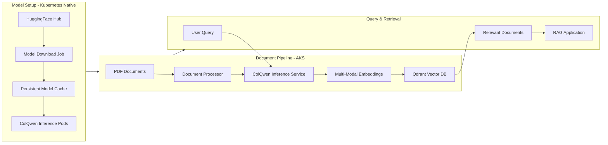

# ColPali on Azure Kubernetes Service (AKS)

[](https://github.com/microsoft/dstoolkit-multi-modal-rag-with-colpali/actions/workflows/ci.yml)

Multi-modal RAG solution powered by ColPali for intelligent document understanding and retrieval. Deploy ColPali models natively on AKS with Kubernetes-native inference, document processing, and high-performance vector search with Qdrant.



## What is ColPali?

ColPali combines visual and textual understanding to process documents as images, capturing layout, formatting, and visual elements that traditional text-only approaches miss. Perfect for complex documents like reports, forms, and technical papers.

## Key Features

- **Multi-Modal Intelligence**: Processes both text and visual document elements
- **Kubernetes-Native Deployment**: ColQwen inference runs directly on AKS pods
- **Optimized Model Lifecycle**: Single download job with persistent cache shared across replicas
- **Vector Search**: High-performance similarity search with Qdrant vector database
- **Production Ready**: Complete infrastructure with monitoring, health checks, and security

## Quick Start

Ready to deploy? See the **[scripts/README.md](scripts/README.md)** for complete deployment instructions and automation scripts.

### Prerequisites
- Azure subscription
- Azure CLI
- Python 3.11+

Once deployed, upload PDFs to the storage container and watch them get processed automatically!

## Architecture

For detailed component descriptions, deployment topology, and technical specifications, see the **[Infrastructure Guide](infra/README.md)**.

## Why Qdrant + AKS?

### Why Qdrant over AI Search?
- **Multi-Vector Limits**: AI Search has a 100 multi-vector limit per document, while Qdrant has no such restriction - critical for ColPali's page-based embeddings
- **Advanced Operations**: Qdrant supports reranking and MAX_SIM operations that AI Search doesn't provide

### Why AKS over Container Apps?
- **Managed Disk Support**: Qdrant requires persistent managed disk storage (not NFS volumes) for optimal performance per Qdrant's recommendations. This is not possible with other container based setups on Azure.
- **Simpler Setup**: No need to setup multiple Azure Services to host the different services.

### Why AKS over Azure ML?

- **Shared Compute Costs**: Multiple services (document processor + ColQwen inference) share the same node pool
- **Single Platform**: Document processor and inference unified on same AKS cluster

**Looking for an approach with Azure Machine Learning?** A previous version of this repository, utilised AML for the hosting of the endpoint. You can find the code at in this commit [a5c7c0811e2b596cf6e68905512901ae3bb460a2](https://github.com/microsoft/dstoolkit-multi-modal-rag-with-colpali/tree/a5c7c0811e2b596cf6e68905512901ae3bb460a2).

## Project Structure

```
├── infra/              # Bicep infrastructure templates
├── modules/
│   ├── colpali/        # ColPali model setup & deployment
│   └── document_processor/  # FastAPI document processing service
├── helm/               # Helm charts for AKS deployment
└── scripts/            # Deployment automation
```

## How It Works

1. **PDF Upload** → Triggers document processing via AKS service
2. **Document Processing** → Extracts pages as high-resolution images
3. **ColQwen Inference** → Generates multi-modal embeddings via Kubernetes-native pods
4. **Vector Storage** → Stores embeddings in Qdrant vector database with metadata
5. **Query & Retrieve** → Semantic search returns relevant document sections via Qdrant
6. **Intelligent Retrieval** → AI Foundry's models power advanced RAG capabilities

## Documentation

- **[Infrastructure Guide](infra/README.md)** - Detailed architecture and deployment
- **[Deployment Guide](scripts/README.md)** - Step-by-step setup instructions

## Contributing

We welcome contributions! Please see our [Contributing Guide](CONTRIBUTING.md) for details on:

- Setting up pre-commit hooks for automatic code quality checks
- Code standards and linting requirements
- Submitting pull requests

Quick start:
1. Fork the repository
2. Install pre-commit hooks: `pip install pre-commit && pre-commit install`
3. Create a feature branch
4. Make your changes (hooks will run automatically on commit)
5. Submit a pull request

## License

MIT License - see [LICENSE](LICENSE) for details.
