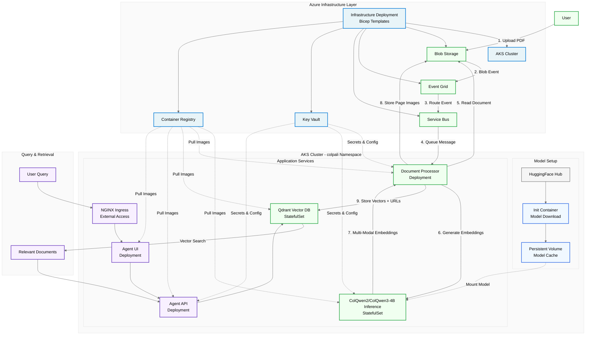

# Multi-Modal RAG with ColPali on Azure Kubernetes Service (AKS)

[](https://github.com/microsoft/multi-modal-rag-with-colpali/actions/workflows/ci.yml)

> [!WARNING]
>
> This code is provided as an accelerator implementation and should be carefully reviewed and adjusted before being used in your environments. This is a demonstration, and is **not a production ready solution**.

This repository provides a multi-modal RAG (Retrieval-Augmented Generation) solution that processes documents visually using late interaction embedding techniques. Unlike traditional approaches that compress entire documents into single vectors, late interaction methods preserve fine-grained token information—each document page is represented as an image and embedded to produce hundreds of token-level embeddings. This means query tokens can be compared against document tokens directly, capturing layout, charts, tables, and visual elements that OCR pipelines typically lose.

This repository uses **ColPali**, but any late interaction embedding model can be substituted.

## Vision Language Models & ColPali

This solution offers an alternative approach to traditional multi-modal RAG implementations by leveraging Vision Language Models (VLMs). Unlike conventional methods that require complex preprocessing pipelines, VLMs process documents holistically as images, significantly reducing system complexity.

**Why vision models over traditional text extraction?**

Traditional approaches require complex chunking strategies, OCR preprocessing (with its accuracy issues), image verbalization, and separate handling for text, tables, and visual elements. Vision Language Models process documents directly as images, understanding visual layouts and relationships without chunking or OCR. Everything—text, tables, charts, diagrams—is handled uniformly.

### What is ColPali?

ColPali is a multi-modal document understanding model that processes documents as images rather than extracted text. Unlike traditional text-only approaches, ColPali generates embeddings that capture both textual content and visual layout information.


*ColPali Architecture - Image source: [illuin-tech/colpali](https://github.com/illuin-tech/colpali) repository*

**Key characteristics:**
- **Visual Processing**: Processes document pages as images, preserving layout and formatting
- **Page-Level Embeddings**: Generates vector representations for entire document pages
- **Multi-Modal**: Understands both text and visual elements like tables, charts, and document structure
- **No OCR Required**: Bypasses text extraction preprocessing steps

This implementation uses **ColQwen2** and **ColQwen3-4B**, variants that extend ColPali's approach with additional language support and inference optimizations.

ColPali was introduced in the paper ["ColPali: Efficient Document Retrieval with Vision Language Models"](https://arxiv.org/abs/2407.01449) by Manuel Faysse, Hugues Sibille, Tony Wu, et al. (2024).

## What's Included

This is a complete end-to-end deployment for Azure. The main complexity is hosting a model serving layer and building a custom indexing pipeline—both are handled here.

**Components:**
- Event-driven document processing pipeline (Blob Storage → Event Grid → Service Bus)
- ColQwen2/ColQwen3-4B inference service on AKS with model caching
- Qdrant vector database for similarity search
- Complete infrastructure as code (Bicep templates)
- Docker images and Helm charts for all services
- Agent API and UI for querying

### Architecture Overview

#### Event-Driven Document Processing
1. **PDF Upload** → Users upload documents to Azure Blob Storage
2. **Event Trigger** → Storage generates blob events, routed by Event Grid to Service Bus
3. **Async Processing** → Document Processor consumes queue messages and reads documents
4. **Image Extraction** → Documents converted to high-resolution page images
5. **AI Inference** → ColQwen2/ColQwen3-4B generates multi-modal embeddings on AKS pods
6. **Image Storage** → Page images uploaded to Azure Blob Storage for retrieval
7. **Vector Storage** → Embeddings stored in Qdrant with metadata and image URLs

#### Query & Retrieval
8. **User Queries** → Submitted via NGINX Ingress to Qdrant vector database
9. **Semantic Search** → Vector similarity search returns relevant document sections with image URLs
10. **Image Retrieval** → Page images fetched from Azure Blob Storage using stored URLs
11. **RAG Integration** → Results with images consumed by AI Foundry models for intelligent responses




For detailed component descriptions, deployment topology, and technical specifications, see the **[Infrastructure Guide](modules/infra/README.md)**.

## Why Qdrant Vector Data + Azure Kubernetes Service?

### Why Qdrant over AI Search?
- **Multi-Vector Limits**: AI Search has a 100 multi-vector limit per document, while Qdrant has no such restriction - critical for ColPali's page-based embeddings
- **Advanced Operations**: Qdrant supports reranking and MAX_SIM operations that AI Search doesn't provide
- **Storage Optimization**: By storing page images in Azure Blob Storage and only vectors in Qdrant, we significantly reduce memory requirements and vector database storage costs

### Why AKS over Container Apps?
- **Managed Disk Support**: Qdrant requires persistent managed disk storage (not NFS volumes) for optimal performance per Qdrant's recommendations. This is not possible with other container based setups on Azure.
- **Simpler Setup**: No need to setup multiple Azure Services to host the different services.
- **Shared Compute Costs**: Multiple services (document processor + ColQwen2/ColQwen3-4B inference) share the same node pool

## Project Structure

```
├── modules/
│   ├── agent/          # RAG agent application
│   ├── colpali_inference/   # ColQwen2/ColQwen3-4B inference service
│   ├── document_processor/  # FastAPI document processing service
│   ├── helm/           # Helm charts for AKS deployment
│   └── infra/          # Bicep infrastructure templates
└── scripts/            # Deployment automation
```

## Scalability Optimizations

Two techniques make ColPali embeddings practical at scale:

**[Hierarchical token pooling](https://github.com/illuin-tech/colpali?tab=readme-ov-file#token-pooling)** (from the ColPali team) reduces embedding dimensions by ~3x while maintaining retrieval quality.

**Mean row and column pooling** (from [Qdrant's PDF retrieval tutorial](https://qdrant.tech/documentation/advanced-tutorials/pdf-retrieval-at-scale/)) compresses embeddings further for fast initial retrieval.

**Two-stage retrieval:**
1. L1 uses row/column pooled embeddings for fast candidate selection
2. L2 reranks with hierarchical pooled embeddings for accuracy

**Chosen approach:** We use row/column mean pooling for L1 and hierarchical pooling for L2 with quantized prefetch (`mean_pooling_with_hierarchical_quantized_prefetch_only`) based on benchmarking results.

This balances speed and quality for production deployments.

## Quick Start

Ready to deploy? See the **[scripts/README.md](scripts/README.md)** for complete deployment instructions and automation scripts.

> [!WARNING]
>
> This code is provided as an accelerator implementation and should be carefully reviewed and adjusted before being used in your environments. This is a demonstration, and is **not a production ready solution**.

### Prerequisites
- Azure subscription
- Azure CLI
- Python 3.11+

## Contributing

We welcome contributions! Please see our [Contributing Guide](CONTRIBUTING.md) for details on:

- Setting up pre-commit hooks for automatic code quality checks
- Code standards and linting requirements
- Submitting pull requests

Quick start:
1. Fork the repository
2. Install pre-commit hooks: `pip install pre-commit && pre-commit install`
3. Create a feature branch
4. Make your changes (hooks will run automatically on commit)
5. Submit a pull request

## License

MIT License - see [LICENSE](LICENSE) for details.
