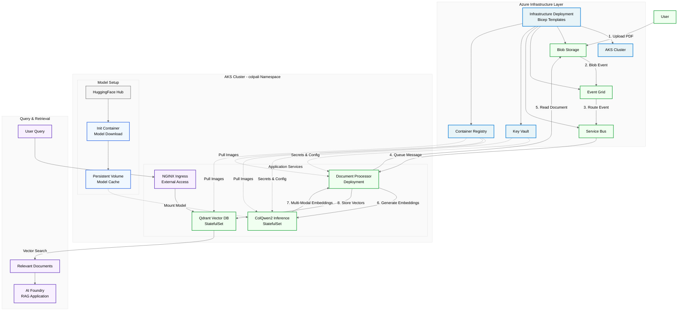

# ColPali on Azure Kubernetes Service (AKS)

[](https://github.com/microsoft/dstoolkit-multi-modal-rag-with-colpali/actions/workflows/ci.yml)

> [!WARNING]
>
> This code is provided as an accelerator implementation and should be carefully reviewed and adjusted before being used in your environments. This is a demonstration, and is **not a production ready solution**.

This repository provides a **complete, deployment ready multi-modal RAG (Retrieval-Augmented Generation) solution** that processes documents visually using ColPali technology. Unlike traditional text-extraction approaches, this system understands documents as images, capturing layout, charts, tables, and visual elements that are often lost in OCR pipelines.

## Vision Language Models & ColPali

This solution offers an alternative approach to traditional multi-modal RAG implementations by leveraging Vision Language Models (VLMs). Unlike conventional methods that require complex preprocessing pipelines, VLMs process documents holistically as images, significantly reducing system complexity.

**Traditional Approach Challenges:**
- Complex chunking strategies for mixed content types
- Image verbalization and description generation
- OCR preprocessing with potential accuracy issues
- Separate handling of text, tables, and visual elements

**Vision Language Model Benefits:**
- Direct image processing eliminates chunking complexity
- Native understanding of visual layouts and relationships
- No OCR preprocessing required
- Unified handling of all document elements (text, tables, charts, diagrams)

### What is ColPali?

ColPali is a multi-modal document understanding model that processes documents as images rather than extracted text. Unlike traditional text-only approaches, ColPali generates embeddings that capture both textual content and visual layout information.


*ColPali Architecture - Image source: [illuin-tech/colpali](https://github.com/illuin-tech/colpali) repository*

**Key characteristics:**
- **Visual Processing**: Processes document pages as images, preserving layout and formatting
- **Page-Level Embeddings**: Generates vector representations for entire document pages
- **Multi-Modal**: Understands both text and visual elements like tables, charts, and document structure
- **No OCR Required**: Bypasses text extraction preprocessing steps

This implementation uses **ColQwen2**, a variant that extends ColPali's approach with additional language support and inference optimizations.

ColPali was introduced in the paper ["ColPali: Efficient Document Retrieval with Vision Language Models"](https://arxiv.org/abs/2407.01449) by Manuel Faysse, Hugues Sibille, Tony Wu, et al. (2024).

## Azure Accelerator for Vision RAG

This accelerator contains significant engineering effort to deploy ColPali/ColQwen2 end-to-end in Azure environments. Rather than starting from scratch, you can leverage this tested, production-ready foundation to rapidly implement multi-modal document understanding capabilities.

**Complete End-to-End Platform:**
- **Document Processing Pipeline**: Automated ingestion from Azure Blob Storage with event-driven processing
- **ColQwen2 Inference Service**: Kubernetes-native deployment with optimized model loading and caching
- **Vector Search Engine**: High-performance Qdrant database for similarity-based document retrieval
- **Production Infrastructure**: Full Azure deployment with security, monitoring, and scalability built-in

**Key Components:**
- **Infrastructure as Code**: Complete Bicep templates for reproducible Azure deployments
- **Containerized Services**: Docker images for ColQwen2 inference and document processing
- **Helm Charts**: Production-ready Kubernetes deployments with best practices
- **Event-Driven Architecture**: Automatic processing triggered by document uploads

### Architecture Overview

#### Event-Driven Document Processing
1. **PDF Upload** → Users upload documents to Azure Blob Storage
2. **Event Trigger** → Storage generates blob events, routed by Event Grid to Service Bus
3. **Async Processing** → Document Processor consumes queue messages and reads documents
4. **Image Extraction** → Documents converted to high-resolution page images
5. **AI Inference** → ColQwen2 generates multi-modal embeddings on AKS pods
6. **Vector Storage** → Embeddings stored in Qdrant with document metadata

#### Query & Retrieval
7. **User Queries** → Submitted via NGINX Ingress to Qdrant vector database
8. **Semantic Search** → Vector similarity search returns relevant document sections
9. **RAG Integration** → Results consumed by AI Foundry models for intelligent responses




For detailed component descriptions, deployment topology, and technical specifications, see the **[Infrastructure Guide](infra/README.md)**.

## Why Qdrant Vector Data + Azure Kubernetes Service?

### Why Qdrant over AI Search?
- **Multi-Vector Limits**: AI Search has a 100 multi-vector limit per document, while Qdrant has no such restriction - critical for ColPali's page-based embeddings
- **Advanced Operations**: Qdrant supports reranking and MAX_SIM operations that AI Search doesn't provide

### Why AKS over Container Apps?
- **Managed Disk Support**: Qdrant requires persistent managed disk storage (not NFS volumes) for optimal performance per Qdrant's recommendations. This is not possible with other container based setups on Azure.
- **Simpler Setup**: No need to setup multiple Azure Services to host the different services.

### Why AKS over Azure ML?

- **Shared Compute Costs**: Multiple services (document processor + ColQwen inference) share the same node pool
- **Single Platform**: Document processor and inference unified on same AKS cluster

**Looking for an approach with Azure Machine Learning?** A previous version of this repository, utilised AML for the hosting of the endpoint. You can find the code at in this commit [a5c7c0811e2b596cf6e68905512901ae3bb460a2](https://github.com/microsoft/dstoolkit-multi-modal-rag-with-colpali/tree/a5c7c0811e2b596cf6e68905512901ae3bb460a2).

## Project Structure

```
├── infra/              # Bicep infrastructure templates
├── modules/
│   ├── colpali/        # ColPali model setup & deployment
│   └── document_processor/  # FastAPI document processing service
├── helm/               # Helm charts for AKS deployment
└── scripts/            # Deployment automation
```

## Scalability Optimizations

This implementation incorporates two key optimisations to enable efficient scaling of ColPali embeddings:

### Hierarchical Token Pooling

We utilize [hierarchical token pooling](https://github.com/illuin-tech/colpali?tab=readme-ov-file#token-pooling) developed by the ColPali team to reduce embedding dimensions by approximately 3x. This technique significantly decreases storage requirements and computational overhead while preserving retrieval quality.

### Mean Row and Column Pooling

We implement mean row and column pooling techniques, suggested by the Qdrant team from their [PDF retrieval at scale tutorial](https://qdrant.tech/documentation/advanced-tutorials/pdf-retrieval-at-scale/), which further compress embeddings for efficient initial retrieval stages.

### Two-Stage Retrieval Architecture

By combining both optimization techniques, we achieve a hybrid approach:

1. **L1 Retrieval**: Uses mean row and column pooled embeddings for fast initial candidate selection
2. **L2 Reranking**: Applies hierarchical pooled embeddings for precise final ranking

This two-stage architecture balances retrieval speed with accuracy, enabling scalable deployment while maintaining high-quality results.

## Quick Start

Ready to deploy? See the **[scripts/README.md](scripts/README.md)** for complete deployment instructions and automation scripts.

> [!WARNING]
>
> This code is provided as an accelerator implementation and should be carefully reviewed and adjusted before being used in your environments. This is a demonstration, and is **not a production ready solution**.

### Prerequisites
- Azure subscription
- Azure CLI
- Python 3.11+

## Contributing

We welcome contributions! Please see our [Contributing Guide](CONTRIBUTING.md) for details on:

- Setting up pre-commit hooks for automatic code quality checks
- Code standards and linting requirements
- Submitting pull requests

Quick start:
1. Fork the repository
2. Install pre-commit hooks: `pip install pre-commit && pre-commit install`
3. Create a feature branch
4. Make your changes (hooks will run automatically on commit)
5. Submit a pull request

## License

MIT License - see [LICENSE](LICENSE) for details.
