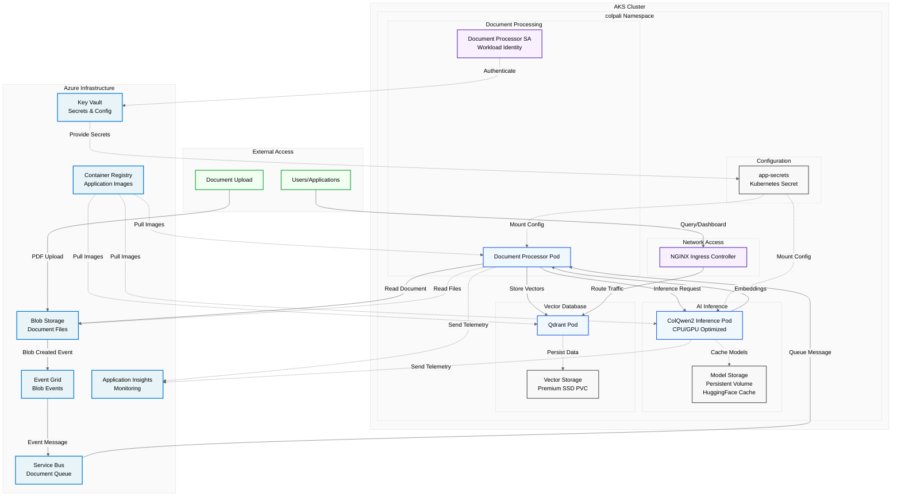

# ColQwen2 Stack Helm Chart

Simple Helm chart that deploys the complete ColQwen2 multi-modal RAG stack using dependencies.

## Components

This chart deploys four main components:
- **Qdrant** - Vector database for embeddings storage (via dependency)
- **NGINX Ingress** - Load balancer and ingress controller (via dependency)
- **ColQwen2 Inference** - AI model service for generating document embeddings
- **Document Processor** - Service that processes documents and orchestrates embedding creation

## Prerequisites

1. Run infrastructure deployment: `.\scripts\windows\deploy_infra.ps1`
2. Have kubectl and helm installed

## Deploy Everything

```powershell
.\scripts\windows\apply_helm.ps1
```

This automatically:
1. Updates Helm dependencies (`helm dependency update`)
2. Deploys all components with proper configuration
3. Sets up Qdrant with Premium SSD storage
4. Configures ingress for Qdrant dashboard access

## Access Qdrant Dashboard

After deployment, get the ingress IP:
```bash
kubectl get ingress
```

Access Qdrant dashboard at: `http://<INGRESS-IP>/qdrant`

## Pods and Services
- **Document Processor**: Processes documents, creates embeddings via ColQwen2, stores in Qdrant
- **ColQwen2 Inference**: AI model for generating document embeddings (CPU/GPU optimized)
- **Qdrant**: Vector database for storing and searching embeddings
- **NGINX Ingress**: Provides external access to services and Qdrant dashboard

## Configuration

The chart uses Helm dependencies defined in `Chart.yaml`:
- `qdrant` from https://qdrant.github.io/qdrant-helm
- `ingress-nginx` from https://kubernetes.github.io/ingress-nginx

Values are passed from the deployment script via `--set` parameters.

## Architecture Overview

### Pod Architecture


**Legend:**
- **Solid arrows**: Data/request flow
- **Dashed arrows**: Authentication/configuration
- **Dotted arrows**: Storage/monitoring relationships
