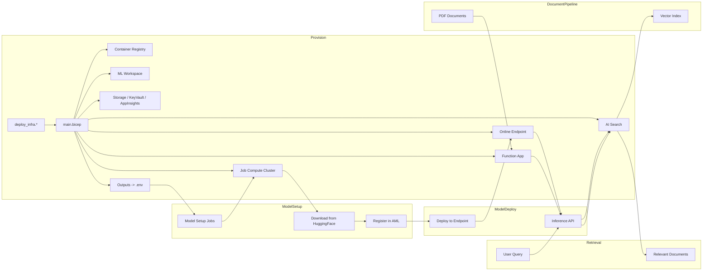

# Infrastructure

End‑to‑end Azure foundation for hosting ColPali multi‑modal RAG (Retrieval‑Augmented Generation) solution. Azure Machine Learning orchestrates ColPali model deployment with GPU‑accelerated online endpoints; Function App provides document indexing pipeline with AI Search for vector storage and retrieval; Container Registry stores model artifacts and deployment images. Supporting services include Storage, Key Vault, and Application Insights for data persistence, secrets management, and operational monitoring.



Below is the topology of the Azure resources deployed:


## What We Deploy & Why

| Component | Why it exists |
|-----------|---------------|
| Container Registry (`acr${baseName}`) | Stores model artifacts, custom images, and deployment containers for ML workflows. |
| AI Foundry Workspace (`aif-${baseName}`) | Unified AI platform workspace for orchestrating ML operations, model management, and AI workflow coordination. |
| AML Supporting: Storage (`st${baseName}`), Key Vault (`kv-${baseName}`), App Insights (`appi-${baseName}`) | Storage for model artifacts, datasets & file shares; secrets (API keys, connection strings) via RBAC; operational telemetry and monitoring. |
| Azure ML Workspace (`ml-${baseName}`) | Orchestrates ColPali model registration, deployment, and manages both job clusters and inference endpoints. System‑assigned identity for secure resource access. |
| Job Compute Cluster (`gpu-cluster-${baseName}`) | GPU compute cluster for model setup jobs: downloads ColPali models from HuggingFace, processes them, and registers in AML workspace. Auto-scales from 0 for cost efficiency. |
| Compute Instance (`ci-${baseName}`) | Development compute instance for data scientists to experiment, develop, and test ML models interactively. |
| Online Endpoint (`embedding-endpoint`) | Dedicated inference endpoint hosting deployed ColPali model; provides multi-modal embedding API for real-time document understanding and query processing. |
| Container Apps Environment (`cae-${baseName}`) | Serverless container hosting environment with auto-scaling, load balancing, and managed networking for document processing services. |
| Container Apps (`ca-${baseName}`) | Containerized document processing pipeline; handles PDF ingestion, image extraction, calls ColPali inference endpoint, and orchestrates vector indexing workflows. |
| Data Storage (`ds${baseName}`) | Specialized data lake storage for ML datasets, processed documents, and model artifacts with hierarchical namespace support. |
| Event Grid (`eg-${baseName}`) | Event-driven orchestration service; coordinates document processing workflows, model deployment notifications, and system integration events. |
| Role Assignments | Grants least‑privilege access: Container Apps → ML inference endpoints, data storage; Job Cluster → HuggingFace downloads, model registration; cross-service authentication via managed identities. |

## Structure

```
src/main.bicep                # Orchestrates modules & outputs
src/main.bicepparam           # Parameters (override defaults)
src/modules/                  # Individual resource modules
├── aiFoundry.bicep          # AI Foundry workspace for ML operations
├── aml.bicep                # Azure ML workspace and managed identity
├── amlSupporting.bicep      # Storage, Key Vault, App Insights
├── computeCluster.bicep     # GPU compute cluster for model jobs
├── computeIdentity.bicep    # Managed identity for compute resources
├── computeInstance.bicep    # ML compute instance for development
├── containerApps.bicep      # Container Apps for document processing
├── containerAppsSupporting.bicep # Container Apps environment & supporting resources
├── containerRegistry.bicep   # Container registry for artifacts
├── dataStorage.bicep        # Data storage for ML datasets and models
├── eventGrid.bicep          # Event Grid for workflow orchestration
├── onlineEndpoint.bicep     # ColPali model API endpoint
└── roleAssignments.bicep    # RBAC for cross-service access
```

Key modules enable multi-modal RAG: `aml.bicep` orchestrates ML workspace; `aiFoundry.bicep` provides AI platform services; `computeCluster.bicep` provides job cluster for model setup; `onlineEndpoint.bicep` hosts ColPali inference; `containerApps.bicep` processes documents; `dataStorage.bicep` manages data persistence; `roleAssignments.bicep` secures integrations.

## Naming Conventions

- Container Registry: `acr${baseName}` (hyphens stripped)
- AI Foundry Workspace: `aif-${baseName}`
- ML Workspace: `ml-${baseName}`
- Job Compute Cluster: `gpu-cluster-${baseName}` (for model setup jobs)
- Compute Instance: `ci-${baseName}`
- Online Endpoint: `embedding-endpoint` (for inference)
- Container Apps Environment: `cae-${baseName}`
- Container Apps: `ca-${baseName}`
- Data Storage: `ds${baseName}` (trimmed to Azure length rules)
- Event Grid: `eg-${baseName}`
- Storage: `st${baseName}` (trimmed to Azure length rules)
- Key Vault: `kv-${baseName}`
- App Insights: `appi-${baseName}`

## Key Parameters

| Param | Purpose | Default |
|-------|---------|---------|
| `baseName` | Resource name prefix | (required) |
| `location` | Deployment region | RG location |
| `acrSku` | Container registry tier | `Basic` |
| `amlSku` | ML workspace tier | `Basic` |
| `aiSearchSku` | AI Search service tier | `basic` |
| `amlEmbeddingEndpointType` | GPU instance for ColPali | `Standard_NC24ads_A100_v4` |
| `amlEmbeddingEndpointCount` | Endpoint instance count | `1` |
| `jobInstanceType` | GPU cluster VM size | `Standard_NC16as_T4_v3` |
| `jobInstanceCount` | Max cluster instances | `1` |
| `deployRoleAssignments` | Skip RBAC on repeat runs | `false` |

## ColPali Model Configuration

The infrastructure supports GPU-accelerated ColPali with distinct components for setup and inference:

- **Job Compute Cluster**: `Standard_NC16as_T4_v3` for model setup jobs (HuggingFace download, registration)
  - Auto-scaling from 0 to configured max instances for cost efficiency
  - Handles model preparation and AML workspace registration
- **Online Endpoint**: `Standard_NC24ads_A100_v4` (A100 GPU for optimal inference performance)
  - Dedicated endpoint for real-time ColPali inference API
  - Separate from job cluster to ensure consistent inference availability
- **Container Apps**: Configured for scalable PDF processing with ColPali integration
  - Auto-scaling based on HTTP requests and CPU utilization
  - Containerized document processing pipeline with custom resource limits
  - Event-driven workflow coordination via Event Grid integration
  - Stateless architecture for high availability and performance

## How to Deploy

Use the platform scripts – see `scripts/README.md` (`deploy_infra.*`). They provision Azure resources and write a `.env` file consumed by model deployment, document indexing, and application scripts.

1. **Infrastructure**: `deploy_infra.*` creates all Azure resources (clusters + endpoints + container environment)
2. **Model Setup**: Python scripts run jobs on compute cluster to download ColPali from HuggingFace and register in AML
3. **Model Deployment**: Python scripts deploy registered ColPali model to the online endpoint for inference
4. **Container Apps Deployment**: Deploy document processing containers to Container Apps environment
5. **Data Pipeline Setup**: Configure Event Grid triggers and data storage workflows for document processing

## Outputs

Key outputs for integration and deployment:

- `acrLoginServer`, `acrName` - Container registry for artifacts
- `aiFoundryWorkspaceName`, `aiFoundryWorkspaceUrl` - AI Foundry workspace for ML operations
- `amlWorkspaceName`, `amlEmbeddingEndpointScoringUri` - ML workspace and ColPali API
- `containerAppsEnvironmentName`, `containerAppName` - Document processing service
- `dataStorageAccountName`, `dataStorageUrl` - Data lake for ML datasets and processed documents
- `eventGridTopicName`, `eventGridEndpoint` - Event orchestration service
- `storageAccountName`, `keyVaultName` - Supporting services
- All configuration exported to `.env` for downstream scripts
