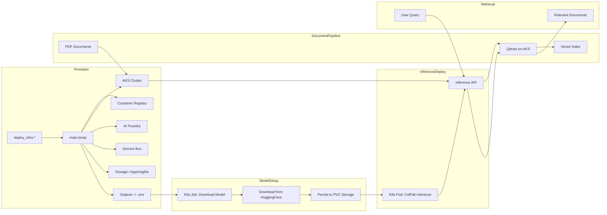

# Infrastructure

End‑to‑end Azure foundation for hosting ColPali multi‑modal RAG (Retrieval‑Augmented Generation) solution using pure Kubernetes approach. AKS provides scalable Kubernetes-based document processing pipeline with Qdrant for vector storage and retrieval; Container Registry stores deployment images; AI Foundry provides LLM services; Supporting services include Storage, Service Bus, and Application Insights for data persistence, message queuing, and operational monitoring.



Below is the topology of the Azure resources deployed:


## What We Deploy & Why

| Component | Why it exists |
|-----------|---------------|
| Container Registry (`acr${baseName}`) | Stores custom container images for document processing and ColPali inference deployments. |
| AI Foundry Workspace (`aif-${baseName}`) | Provides LLM services and AI platform capabilities for the RAG solution. |
| AKS Cluster (`aks-${baseName}`) | Kubernetes cluster hosting all application services with Helm-based deployments. Provides auto-scaling, load balancing, and managed networking for containerized workloads. |
| ColPali Model Download Job | Kubernetes Job that downloads ColPali models from HuggingFace and persists them to Persistent Volume Claims (PVCs) for access by inference pods. |
| ColPali Inference Deployment | Kubernetes StatefulSet running ColPali inference pods with individual PVCs for model storage, serving multi-modal embedding API for real-time document understanding. |
| Qdrant Vector Database | High-performance vector database deployed on AKS via Helm; handles multi-modal document embeddings and similarity search for RAG operations. |
| Document Processor Service | Containerized FastAPI application deployed on AKS; handles PDF ingestion, image extraction, calls ColPali inference endpoint, and orchestrates vector indexing workflows. |
| Data Storage (`stdata${baseName}`) | Blob storage for processed documents and application data with hierarchical namespace support. |
| Service Bus (`sbns-${baseName}`) | Message queuing service for asynchronous document processing workflows; handles reliable message delivery with RBAC-based authentication. |
| Role Assignments | Grants least‑privilege access using Azure RBAC and managed identities: AKS workloads → data storage, Service Bus queues, container registry; cross-service authentication via user-assigned managed identities and workload identity federation. |

## Structure

```
src/main.bicep                # Orchestrates modules & outputs
src/main.bicepparam           # Parameters (override defaults)
src/modules/                  # Individual resource modules
├── aiFoundry.bicep          # AI Foundry workspace for LLM services
├── aks.bicep                # AKS cluster for Kubernetes workloads
├── aksFederatedIdentity.bicep # Workload identity for AKS pods
├── aksKubeletAcrAccess.bicep # AKS kubelet access to container registry
├── aksSupporting.bicep      # AKS supporting resources (networking, etc.)
├── containerRegistry.bicep   # Container registry for application images
├── dataStorage.bicep        # Blob storage for documents and data
├── monitoring.bicep         # Application Insights and monitoring
├── roleAssignments.bicep    # RBAC for cross-service access
└── serviceBus.bicep         # Service Bus for reliable message queuing
```

Key modules enable pure Kubernetes multi-modal RAG: `aiFoundry.bicep` provides AI platform and LLM services; `aks.bicep` provisions Kubernetes cluster for all application services; `containerRegistry.bicep` stores custom container images; `dataStorage.bicep` manages document and data persistence; `serviceBus.bicep` provides reliable message queuing; `roleAssignments.bicep` secures integrations with modern RBAC patterns.

## Naming Conventions

Resource names are centrally managed in `main.bicep` and passed to modules for consistency:

- Container Registry: `acr${baseName}` (hyphens stripped)
- AI Foundry Workspace: `aif-${baseName}`
- ML Workspace: `ml-${baseName}`
- Job Compute Cluster: `gpu-cluster-${baseName}` (for model setup jobs)
- Online Endpoint: `embedding-endpoint` (for inference)
- AKS Cluster: `aks-${baseName}`
- Data Storage: `ds${baseName}` (trimmed to Azure length rules)
- Service Bus Namespace: `sbns-${baseName}`
- Event Grid: `eg-${baseName}`
- Storage: `st${baseName}` (trimmed to Azure length rules)
- Key Vault: `kv-${baseName}`
- App Insights: `appi-${baseName}`
- Log Analytics Workspace: `law-${baseName}`

## Key Parameters

| Param | Purpose | Default |
|-------|---------|---------|
| `baseName` | Resource name prefix | (required) |
| `location` | Deployment region | RG location |
| `acrSku` | Container registry tier | `Basic` |
| `amlSku` | ML workspace tier | `Basic` |
| `amlEmbeddingEndpointType` | GPU instance for ColPali | `Standard_NC24ads_A100_v4` |
| `amlEmbeddingEndpointCount` | Endpoint instance count | `1` |
| `jobInstanceType` | GPU cluster VM size | `Standard_NC16as_T4_v3` |
| `jobInstanceCount` | Max cluster instances | `1` |
| `aksNodeVmSize` | AKS node pool VM size | `Standard_D4s_v3` |
| `aksNodeCount` | Initial AKS node count | `3` |
| `deployRoleAssignments` | Skip RBAC on repeat runs | `false` |
| `createOnlineEndpoint` | Create endpoint (auto-detected by deployment scripts) | `true` |

**Note on `createOnlineEndpoint`**: The deployment scripts automatically detect if the online endpoint already exists and skip creation to preserve traffic allocation. This parameter is automatically set by the scripts and typically doesn't need manual configuration.

## ColPali Model Configuration

The infrastructure supports GPU-accelerated ColPali with distinct components for setup and inference:

- **Job Compute Cluster**: `Standard_NC16as_T4_v3` for model setup jobs (HuggingFace download, registration)
  - Auto-scaling from 0 to configured max instances for cost efficiency
  - Handles model preparation and AML workspace registration
- **AKS Cluster**: Kubernetes-based container orchestration for all application services
  - Auto-scaling based on HTTP requests and CPU utilization via Horizontal Pod Autoscaler
  - Helm-based deployment of document processor, ColPali inference, and Qdrant vector database
  - Workload identity integration for secure access to Azure services
  - Ingress controller for external access and load balancing
  - Persistent Volume Claims (PVCs) with Premium SSD storage for model persistence and multi-node scaling

## How to Deploy

Use the platform scripts – see `scripts/README.md` (`deploy_infra.*`). They provision Azure resources and write a `.env` file consumed by Kubernetes deployment and application scripts.

1. **Infrastructure**: `deploy_infra.*` creates all Azure resources (AKS cluster + supporting services)
2. **Kubernetes Deployment**: `apply_helm.*` deploys all services to AKS cluster via Helm charts including:
   - ColPali model download Job
   - ColPali inference Deployment
   - Document processor service
   - Qdrant vector database

## Outputs

Key outputs for integration and deployment:

- `acrLoginServer`, `acrName` - Container registry for application images
- `aiFoundryWorkspaceName`, `aiFoundryWorkspaceUrl` - AI Foundry workspace for LLM services
- `aksClusterName`, `aksIdentityClientId` - AKS cluster and workload identity for Kubernetes deployments
- `dataStorageAccountName`, `dataStorageUrl` - Blob storage for documents and application data
- `serviceBusNamespaceName`, `serviceBusQueueName` - Message queuing service for document processing workflows
- All configuration exported to `.env` for downstream scripts
