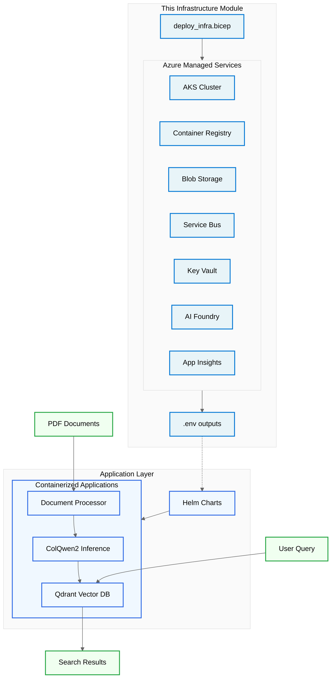
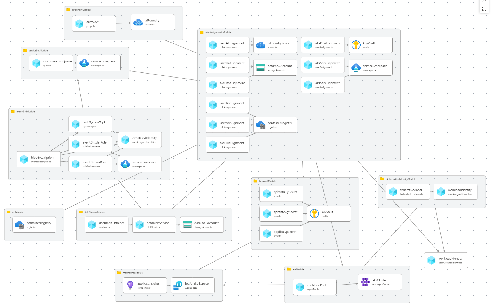

# Infrastructure

Azure foundation services for ColQwen2 multi‑modal RAG solution. This module provisions the managed Azure services required to host containerized document processing and AI inference workloads on Kubernetes.

This infrastructure code creates **only** the Azure managed services. The actual ColQwen2 applications (model inference, document processing, vector database) are deployed separately to the AKS cluster via Helm charts in the `/modules` directory.



Below is the topology of the Azure resources deployed by this module:



## Azure Infrastructure Components

The following Azure managed services provide the foundation for the Kubernetes-based workloads:

| Component | Resource Type | Why it exists |
|-----------|---------------|---------------|
| Container Registry (`acr${baseName}`) | Azure Container Registry | Stores custom container images for document processing and ColPali inference deployments. |
| AI Foundry Workspace (`aif-${baseName}`) | Azure AI Foundry | Provides LLM services and AI platform capabilities for the RAG solution. |
| AKS Cluster (`aks-${baseName}`) | Azure Kubernetes Service | Managed Kubernetes cluster hosting all application services with auto-scaling, load balancing, and managed networking. |
| Data Storage (`stdata${baseName}`) | Azure Storage Account | Blob storage for processed documents and application data with hierarchical namespace support. |
| Service Bus (`sbns-${baseName}`) | Azure Service Bus | Message queuing service for asynchronous document processing workflows with reliable delivery and RBAC authentication. |
| Key Vault (`kv-${baseName}`) | Azure Key Vault | Secure storage for application secrets, connection strings, and certificates. |
| Event Grid (`eg-${baseName}`) | Azure Event Grid | Event routing service for document upload notifications and workflow orchestration. |
| Monitoring (`appi-${baseName}`) | Application Insights | Application performance monitoring, logging, and telemetry collection for AKS workloads. |
| Role Assignments | Azure RBAC | Grants least‑privilege access using managed identities: AKS workloads → data storage, Service Bus, container registry via workload identity federation. |

## Kubernetes Application Components

The following services are deployed to the AKS cluster via Helm charts (see `/modules` for implementation):

| Component | Type | Purpose |
|-----------|------|---------|
| ColPali Model Download | Init Container | Downloads ColPali models from HuggingFace and persists to Persistent Volume Claims before inference pods start. |
| ColPali Inference | Deployment | StatefulSet running ColPali inference pods with PVCs for model storage, serving multi-modal embedding API. |
| Document Processor | Deployment | FastAPI application handling PDF ingestion, image extraction, and vector indexing workflows. |
| Qdrant Vector Database | StatefulSet | High-performance vector database for storing document embeddings and similarity search operations. |

## Infrastructure Structure

```
src/main.bicep                # Orchestrates modules & outputs
src/main.bicepparam           # Parameters (override defaults)
src/modules/                  # Azure infrastructure modules
├── aiFoundry.bicep          # AI Foundry workspace for LLM services
├── aks.bicep                # AKS cluster for Kubernetes workloads
├── aksFederatedIdentity.bicep # Workload identity for AKS pod authentication
├── containerRegistry.bicep   # Container registry for application images
├── dataStorage.bicep        # Blob storage for documents and data
├── eventGrid.bicep          # Event Grid for workflow orchestration
├── keyVault.bicep           # Key Vault for secrets management
├── monitoring.bicep         # Application Insights for observability
├── roleAssignments.bicep    # RBAC for cross-service access
└── serviceBus.bicep         # Service Bus for reliable message queuing
```

**Azure Infrastructure**: These Bicep modules provision the Azure managed services that support the Kubernetes workloads.

**Kubernetes Applications**: The actual ColPali services (inference, document processing, vector database) are deployed separately to AKS via Helm charts located in the `/modules` directory.

## Naming Conventions

Azure resource names are centrally managed in `main.bicep` and passed to modules for consistency:

- Container Registry: `acr${baseName}` (hyphens stripped)
- AI Foundry Workspace: `aif-${baseName}`
- AKS Cluster: `aks-${baseName}`
- Data Storage: `stdata${baseName}` (trimmed to Azure length rules)
- Service Bus Namespace: `sbns-${baseName}`
- Event Grid: `eg-${baseName}`
- Key Vault: `kv-${baseName}`
- App Insights: `appi-${baseName}`

## Key Parameters

| Param | Purpose | Default |
|-------|---------|---------|
| `baseName` | Resource name prefix | (required) |
| `location` | Deployment region | RG location |
| `acrSku` | Container registry tier | `Basic` |
| `aksNodeVmSize` | AKS node pool VM size | `Standard_D4s_v3` |
| `aksNodeCount` | Initial AKS node count | `3` |
| `deployRoleAssignments` | Skip RBAC on repeat runs | `false` |

## Architecture Overview

The solution separates Azure infrastructure provisioning from Kubernetes application deployment:

**Azure Infrastructure** (this directory):
- Managed Kubernetes cluster (AKS) for container orchestration
- Container registry for storing application images
- Data services (Storage, Service Bus, Event Grid) for document processing workflows
- Identity and security (Key Vault, RBAC, Workload Identity) for secure access
- Monitoring and observability (Application Insights) for operational visibility

**Kubernetes Applications** (deployed via `/modules`):
- Auto-scaling based on HTTP requests and CPU utilization via Horizontal Pod Autoscaler
- Helm-based deployment of document processor, ColPali inference, and Qdrant vector database
- Workload identity integration for secure access to Azure services without storing credentials
- Persistent Volume Claims (PVCs) for model storage and data persistence

## How to Deploy

This infrastructure module provisions only the Azure foundation services. Application deployment is handled separately.

1. **Azure Infrastructure**: `deploy_infra.*` creates all Azure managed services (AKS cluster + supporting services)
2. **Kubernetes Applications**: Deploy services to AKS via the `/modules` directory (separate from this infrastructure)
   - ColPali model inference service
   - Document processor service
   - Qdrant vector database
   - Supporting services and configurations

## Outputs

Key outputs for Kubernetes application deployment and integration:

- `acrLoginServer`, `acrName` - Container registry for application images
- `aiFoundryWorkspaceName`, `aiFoundryWorkspaceUrl` - AI Foundry workspace for LLM services
- `aksClusterName`, `aksIdentityClientId` - AKS cluster and workload identity for secure pod authentication
- `dataStorageAccountName`, `dataStorageUrl` - Blob storage for documents and application data
- `serviceBusNamespaceName`, `serviceBusQueueName` - Message queuing for document processing workflows
- `keyVaultName`, `keyVaultUrl` - Secure storage for application secrets and certificates
- `eventGridTopicName`, `eventGridEndpoint` - Event routing for workflow orchestration
- All configuration exported to `.env` for Kubernetes deployment scripts
