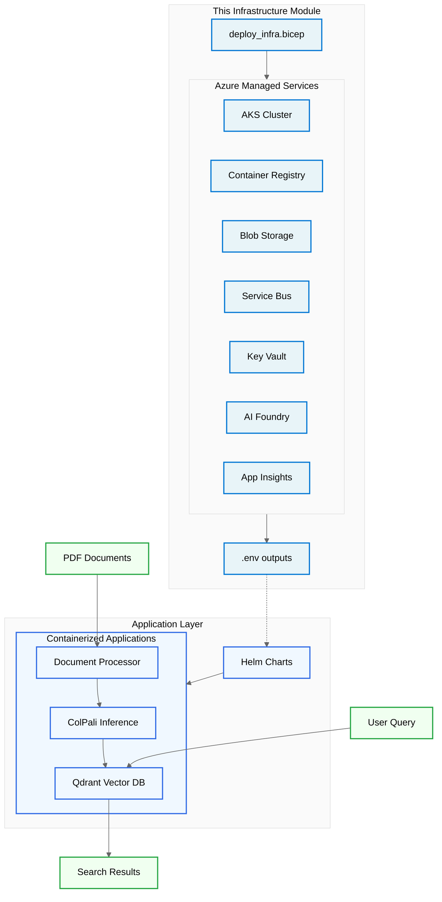

# Infrastructure

Azure infrastructure for the ColPali multi-modal RAG solution. This module provisions all managed Azure services needed to run the containerized workloads on Kubernetes.

This creates **only** the Azure services. The ColPali applications (model inference, document processing, vector database) are deployed separately to AKS via Helm charts in `/modules`.

> [!IMPORTANT]
>
> - The GPU node pool is configured to run on Azure Spot VMs for cost-effective testing. For production environments, provision a regular (non-spot) GPU node pool to avoid eviction-related downtime.



Below is the topology of the Azure resources deployed by this module:


## Azure Infrastructure Components

Azure managed services that support the Kubernetes workloads:

| Component | Resource Type | Purpose |
|-----------|---------------|---------------|
| Container Registry (`acr${baseName}`) | Azure Container Registry | Stores container images for document processing and ColPali inference. |
| AI Foundry Workspace (`aif-${baseName}`) | Azure AI Foundry | LLM services and AI platform for the RAG solution. |
| AKS Cluster (`aks-${baseName}`) | Azure Kubernetes Service | Kubernetes cluster hosting all application services. |
| Data Storage (`stdata${baseName}`) | Azure Storage Account | Blob storage for documents, page images, and application data. |
| Service Bus (`sbns-${baseName}`) | Azure Service Bus | Message queuing for asynchronous document processing. |
| Key Vault (`kv-${baseName}`) | Azure Key Vault | Secure storage for secrets and connection strings. |
| Event Grid (`eg-${baseName}`) | Azure Event Grid | Event routing for document upload notifications. |
| Monitoring (`appi-${baseName}`) | Application Insights | Application monitoring, logging, and telemetry. |
| Role Assignments | Azure RBAC | Managed identity access for AKS workloads to storage, Service Bus, and container registry. |

## Kubernetes Application Components

The following services are deployed to the AKS cluster via Helm charts (see `/modules` for implementation):

| Component | Type | Purpose |
|-----------|------|---------|
| ColPali Model Download | Init Container | Downloads ColPali models from HuggingFace and persists to Persistent Volume Claims before inference pods start. |
| ColPali Inference | Deployment | StatefulSet running ColPali inference pods with PVCs for model storage, serving multi-modal embedding API. |
| Document Processor | Deployment | FastAPI application handling PDF ingestion, image extraction, blob storage upload, and vector indexing workflows. |
| Qdrant Vector Database | StatefulSet | High-performance vector database for storing document embeddings, metadata, and blob storage URLs for similarity search operations. |

## Infrastructure Structure

```
src/main.bicep                # Orchestrates modules & outputs
src/main.bicepparam           # Parameters (override defaults)
src/modules/                  # Azure infrastructure modules
├── aiFoundry.bicep          # AI Foundry workspace for LLM services
├── aks.bicep                # AKS cluster for Kubernetes workloads
├── aksFederatedIdentity.bicep # Workload identity for AKS pod authentication
├── containerRegistry.bicep   # Container registry for application images
├── dataStorage.bicep        # Blob storage for documents and data
├── eventGrid.bicep          # Event Grid for workflow orchestration
├── keyVault.bicep           # Key Vault for secrets management
├── monitoring.bicep         # Application Insights for observability
├── roleAssignments.bicep    # RBAC for cross-service access
└── serviceBus.bicep         # Service Bus for reliable message queuing
src/k8s/                      # Kubernetes cluster bootstrap manifests
├── namespace-spot-tolerations.yaml  # Namespaces with spot instance tolerations
├── gpu-resources-namespace.yaml     # Namespace for GPU infrastructure
├── nvidia-device-plugin.yaml        # NVIDIA device plugin for GPU scheduling
└── dcgm-exporter.yaml               # GPU metrics exporter for Prometheus
```

**Azure Infrastructure**: These Bicep modules provision the Azure managed services that support the Kubernetes workloads.

**Kubernetes Bootstrap**: The `k8s/` folder contains cluster-level Kubernetes manifests that are applied immediately after AKS creation by the `deploy_infra` script. These are infrastructure components (not application workloads) that enable GPU scheduling and monitoring.

**Kubernetes Applications**: The actual ColPali services (inference, document processing, vector database) are deployed separately to AKS via Helm charts located in the `/modules` directory.

## Kubernetes Bootstrap Resources

The following cluster-level resources are deployed by `deploy_infra` after the AKS cluster is created. These are infrastructure prerequisites that must exist before application Helm charts can be deployed.

| Resource | File | Purpose |
|----------|------|---------|
| `colpali-stack` namespace | `namespace-spot-tolerations.yaml` | Application namespace with spot instance tolerations |
| `gpu-resources` namespace | `gpu-resources-namespace.yaml` | Namespace for GPU infrastructure components |
| NVIDIA Device Plugin | `nvidia-device-plugin.yaml` | DaemonSet enabling `nvidia.com/gpu` resource scheduling on GPU nodes |
| DCGM Exporter | `dcgm-exporter.yaml` | GPU metrics (utilization, memory, temperature) for Prometheus monitoring |

> **Note**: These resources were moved from the Helm chart to infrastructure because they are cluster-level components deployed once per cluster, not per-application release. They don't require Helm templating and must exist before application workloads can be scheduled.

## Naming Conventions

Azure resource names are centrally managed in `main.bicep` and passed to modules for consistency:

- Container Registry: `acr${baseName}` (hyphens stripped)
- AI Foundry Workspace: `aif-${baseName}`
- AKS Cluster: `aks-${baseName}`
- Data Storage: `stdata${baseName}` (trimmed to Azure length rules)
- Service Bus Namespace: `sbns-${baseName}`
- Event Grid: `eg-${baseName}`
- Key Vault: `kv-${baseName}`
- App Insights: `appi-${baseName}`

## Architecture Overview

The solution separates Azure infrastructure provisioning from Kubernetes application deployment:

**Azure Infrastructure** (this directory):
- Managed Kubernetes cluster (AKS) for container orchestration
- Container registry for storing application images
- Data services (Storage, Service Bus, Event Grid) for document processing workflows
- Identity and security (Key Vault, RBAC, Workload Identity) for secure access
- Monitoring and observability (Application Insights) for operational visibility

**Kubernetes Applications** (deployed via `/modules`):
- Auto-scaling based on HTTP requests and CPU utilization via Horizontal Pod Autoscaler
- Helm-based deployment of document processor, ColPali inference, and Qdrant vector database
- Workload identity integration for secure access to Azure services without storing credentials
- Persistent Volume Claims (PVCs) for model storage and data persistence

## How to Deploy

This infrastructure module provisions only the Azure foundation services. Application deployment is handled separately.

1. **Azure Infrastructure**: `deploy_infra.*` creates all Azure managed services (AKS cluster + supporting services)
2. **Kubernetes Applications**: Deploy services to AKS via the `/modules` directory (separate from this infrastructure)
   - ColPali model inference service
   - Document processor service
   - Qdrant vector database
   - Supporting services and configurations

## Outputs

Key outputs for Kubernetes application deployment and integration:

- `acrLoginServer`, `acrName` - Container registry for application images
- `aiFoundryWorkspaceName`, `aiFoundryWorkspaceUrl` - AI Foundry workspace for LLM services
- `aksClusterName`, `aksIdentityClientId` - AKS cluster and workload identity for secure pod authentication
- `dataStorageAccountName`, `dataStorageUrl` - Blob storage for documents and application data
- `serviceBusNamespaceName`, `serviceBusQueueName` - Message queuing for document processing workflows
- `keyVaultName`, `keyVaultUrl` - Secure storage for application secrets and certificates
- `eventGridTopicName`, `eventGridEndpoint` - Event routing for workflow orchestration
- All configuration exported to `.env` for Kubernetes deployment scripts
